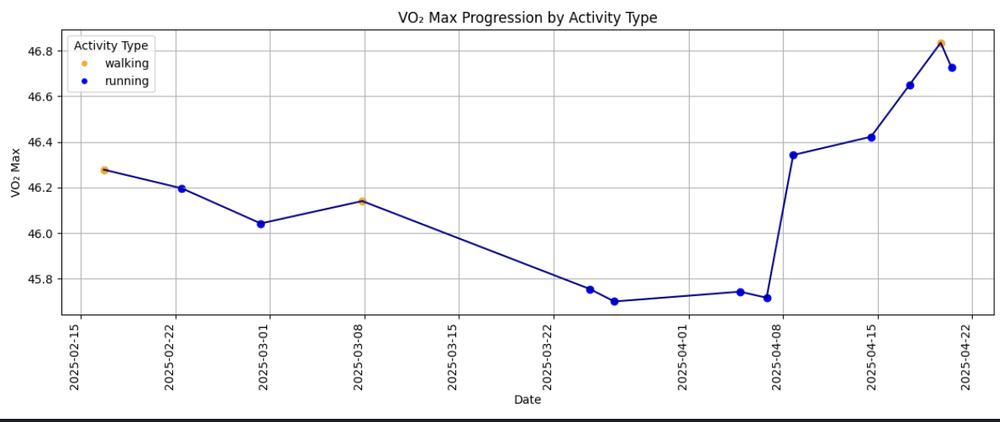

# Garmin Activity Dashboard

A Python tool that downloads your recent Garmin activities, extracts metrics from `.fit` files, and displays an interactive multi-panel dashboard — with per-run panel selection.

**Medium article:** https://medium.com/@daniel.lepold/visualise-your-precise-vo₂-max-from-garmin-data-in-python-2d76e50e437c

---

## Features

- Authenticates via Garmin Connect API with **2FA support and token caching** (2FA only needed on first run)
- Downloads `.fit` files **in memory** — no local files written
- Filters by activity type: Running, Trail Running, Walking, Cycling
- Extracts **VO₂ Max** from `.fit` files via `garmin_fit_sdk`
- Pulls additional metrics from the API: distance, avg/max HR, calories, elevation gain
- **Interactive panel selection** — choose which metrics to visualize each run
- Color-coded scatter points by activity type across all panels

---

## Dashboard panels

At startup you choose which panels to display (1, 2 or all 3):

| # | Panel | Source |
|---|---|---|
| 1 | VO₂ Max progression | FIT file (message 140) |
| 2 | Distance per activity (km) | Garmin Connect API |
| 3 | Average heart rate | Garmin Connect API |

```
What would you like to plot?
  1  VO₂ Max progression
  2  Distance per activity
  3  Average heart rate

Enter numbers separated by commas (e.g. 1,3) or press Enter for all:
```



---

## Quick start

### 1. Clone

```bash
git clone https://github.com/DanielLepold/garmin-fit-parser.git
cd garmin-fit-parser
```

### 2. Install dependencies

```bash
pip install -r requirements.txt
```

### 3. Run (CLI)

```bash
cd src
python main.py --email your@email.com --number 50
```

Password is entered interactively (hidden input). On first run with 2FA enabled you will be prompted for the code — tokens are then cached to `~/.garminconnect/` so all future runs skip 2FA.

---

## CLI options

```
--email     Garmin account email  (or set GARMIN_EMAIL env var)
--number    Number of recent activities to fetch  (default: 50)
--gui       Launch the tkinter GUI instead of CLI
```

### Environment variables (optional)

```bash
export GARMIN_EMAIL=your@email.com
export GARMIN_PASSWORD=yourpassword
python main.py
```

### GUI mode

```bash
python main.py --gui
```

A checkbox dialog lets you pick the panels before the chart is rendered.

---

## 2FA / token caching

On first login with 2FA enabled:

1. A prompt appears: `Enter Garmin 2FA code:`
2. Enter the code from your authenticator app or email
3. Tokens are saved to `~/.garminconnect/`
4. All subsequent runs load the cached tokens — no 2FA prompt

To force a fresh login (e.g. after token expiry), delete `~/.garminconnect/`.

---

## Manual smoke test

A template script is committed at `src/test_run.py.example`. Copy it, fill in your credentials, and run it locally. The filled-in file is gitignored and never committed.

```bash
cp src/test_run.py.example src/test_run.py
```

Open `src/test_run.py` and set your credentials:

```python
EMAIL = "your@email.com"
PASSWORD = "yourpassword"
ACTIVITY_COUNT = 10   # keep small for a quick test
```

Then run:

```bash
cd src
python test_run.py
```

### Example output

```
────────────────────────────────────────────────────────────
  1 / 4  Authentication
────────────────────────────────────────────────────────────
✅ Logged in using saved tokens
  ✅  Login succeeded

────────────────────────────────────────────────────────────
  2 / 4  Activity download
────────────────────────────────────────────────────────────
⬇️  Morning Run (running, 2025-05-10 07:42:00)
⬇️  Trail Adventure (trail_running, 2025-05-08 09:15:00)
  ✅  Got at least one activity  (8 activities)
  ✅  Activity has 'name'
  ✅  Activity has 'time'
  ✅  Activity has 'type'
  ✅  Activity has 'data' (bytes)
  ✅  Activity has 'distance_km'  (9.87 km)
  ✅  Activity has 'avg_hr'  (148 bpm)
  ✅  Activity has 'calories'  (612 kcal)

  First activity: Morning Run | running | 2025-05-10 07:42:00
  dist=9.87 km, avg_hr=148 bpm, calories=612 kcal, elev=84 m

────────────────────────────────────────────────────────────
  3 / 4  FIT file parsing (VO2 Max)
────────────────────────────────────────────────────────────
📂 Parsing: Morning Run
📂 Parsing: Trail Adventure
  ✅  Parsing ran without errors
  ✅  At least one VO2 Max found  (6/8 activities)
    Morning Run: VO2 Max = 51.3
    Trail Adventure: VO2 Max = 51.1

────────────────────────────────────────────────────────────
  4 / 4  Dashboard
────────────────────────────────────────────────────────────
  Rendering dashboard — close the window to finish the test.
  ✅  Dashboard rendered

────────────────────────────────────────────────────────────
  Done
────────────────────────────────────────────────────────────
  Tested 8 activities, 6 with VO2 Max values.
```

---

## Project structure

```
garmin-fit-parser/
├── src/
│   ├── main.py            # Entry point — CLI and GUI launcher
│   ├── garmin_service.py  # Garmin Connect auth + activity download
│   ├── fit_sdk_parser.py  # FIT file decoder — extracts VO₂ Max
│   ├── visualisation.py   # Multi-panel matplotlib dashboard
│   ├── gui.py             # tkinter GUI (--gui flag)
│   └── utils.py           # FIT zip extraction helper
├── requirements.txt
└── README.md
```

---

## Requirements

- Python 3.12+
- `garminconnect==0.2.26`
- `garmin-fit-sdk==21.158.0`
- `matplotlib==3.10.1`
- `tkinter` (bundled with Python)

---

## Privacy & GDPR

This tool runs **entirely on your local machine**. No data is collected, transmitted, or stored by this project beyond what is strictly necessary for authentication.

| Data | How it is handled |
|---|---|
| Email & password | Entered at runtime only. Never written to disk by this tool. |
| Garmin OAuth tokens | Saved locally to `~/.garminconnect/` on your machine. Never sent anywhere except to Garmin's own servers. Delete this folder at any time to remove them. |
| Activity data (FIT files, HR, distance, etc.) | Fetched from Garmin Connect and held in memory for the duration of the process. Nothing is written to disk. |
| VO₂ Max and other health metrics | Processed in memory and displayed locally. Never logged, stored, or transmitted. |

All communication goes directly between your machine and the official [Garmin Connect API](https://connect.garmin.com). This project has no backend, no analytics, and no third-party integrations.

---

## Disclaimer

Not affiliated with Garmin. Use at your own discretion.
